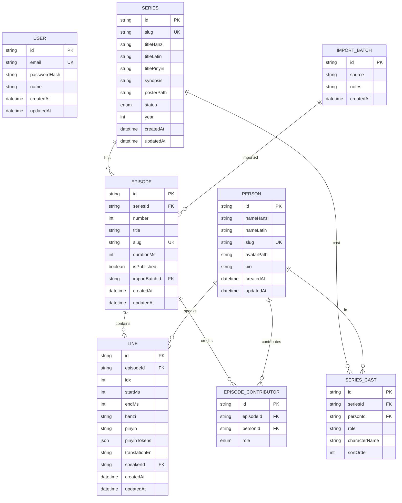

# Baihe — ERD

## Entity Relationship Diagram

## Tables

### `users`
Single admin account.

| Field | Type | Constraints |
|-------|------|-------------|
| id | String | PK, cuid() |
| email | String | Unique |
| passwordHash | String | |
| name | String | Nullable |
| createdAt | DateTime | Default now() |
| updatedAt | DateTime | Auto-update |

---

### `series`
Drama series (百合 audio dramas from Fanjiao).

| Field | Type | Constraints |
|-------|------|-------------|
| id | String | PK, cuid() |
| slug | String | Unique, URL-safe |
| titleHanzi | String | Chinese title |
| titleLatin | String | Romanized title |
| titlePinyin | String | Nullable, pinyin with tones |
| synopsis | String | Nullable |
| posterPath | String | Nullable, path in UPLOADS_DIR |
| status | Enum | ONGOING / COMPLETED / HIATUS |
| year | Int | Nullable |
| createdAt | DateTime | Default now() |
| updatedAt | DateTime | Auto-update |

**Indexes:** `status`

---

### `persons`
Unified table for **cast** (actors) and **contributors** (translators/editors/proofreaders).

| Field | Type | Constraints |
|-------|------|-------------|
| id | String | PK, cuid() |
| nameHanzi | String | Nullable |
| nameLatin | String | |
| slug | String | Unique, nullable |
| avatarPath | String | Nullable |
| bio | String | Nullable |
| createdAt | DateTime | Default now() |
| updatedAt | DateTime | Auto-update |

---

### `series_cast`
Many-to-many: Series ↔ Person (cast members).

| Field | Type | Constraints |
|-------|------|-------------|
| id | String | PK, cuid() |
| seriesId | String | FK → series.id, Cascade |
| personId | String | FK → persons.id, Cascade |
| role | String | e.g. "主役", "配角" |
| characterName | String | Nullable |
| sortOrder | Int | Default 0 |

**Unique:** `(seriesId, personId)`
**Indexes:** `seriesId`, `personId`

---

### `episodes`
Episodes within a series.

| Field | Type | Constraints |
|-------|------|-------------|
| id | String | PK, cuid() |
| seriesId | String | FK → series.id, Cascade |
| number | Int | Episode number |
| title | String | Nullable |
| slug | String | Unique per series, nullable |
| durationMs | Int | Nullable |
| isPublished | Boolean | Default false |
| importBatchId | String | FK → import_batches.id, nullable |
| createdAt | DateTime | Default now() |
| updatedAt | DateTime | Auto-update |

**Unique:** `(seriesId, number)`, `(seriesId, slug)`
**Indexes:** `seriesId`

---

### `episode_contributors`
Many-to-many: Episode ↔ Person (translation credits).

| Field | Type | Constraints |
|-------|------|-------------|
| id | String | PK, cuid() |
| episodeId | String | FK → episodes.id, Cascade |
| personId | String | FK → persons.id, Cascade |
| role | Enum | TRANSLATOR / EDITOR / PROOFREADER |

**Unique:** `(episodeId, personId, role)`
**Indexes:** `episodeId`, `personId`

---

### `lines`
Translation lines — the core content. One row per timestamped segment.

| Field | Type | Constraints |
|-------|------|-------------|
| id | String | PK, cuid() |
| episodeId | String | FK → episodes.id, Cascade |
| idx | Int | Order within episode |
| startMs | Int | Start timestamp (milliseconds) |
| endMs | Int | Nullable end timestamp |
| hanzi | String | Raw Chinese text |
| pinyin | String | Plain space-separated pinyin (for search) |
| pinyinTokens | Json | `[{"h":"你","p":"nǐ"},{"h":"好","p":"hǎo"}]` for ruby |
| translationEn | String | English translation |
| speakerId | String | Nullable FK → persons.id |
| createdAt | DateTime | Default now() |
| updatedAt | DateTime | Auto-update |

**Unique:** `(episodeId, idx)`
**Indexes:** `episodeId`, `speakerId`

**Notes:**
- `pinyinTokens` enables per-character ruby annotation in the reader
- `pinyin` (plain) used for full-text search
- Hover dictionary (meaning/tone) = read-time CC-CEDICT lookup, not stored
- `speakerId` reserved for future "who spoke this line" feature

---

### `import_batches`
Tracks bulk imports from scripts (optional, for open-source contributions).

| Field | Type | Constraints |
|-------|------|-------------|
| id | String | PK, cuid() |
| source | String | e.g. "fanjiao-csv", "manual-script" |
| notes | String | Nullable |
| createdAt | DateTime | Default now() |

---

## Enums

### `SeriesStatus`
- `ONGOING`
- `COMPLETED`
- `HIATUS`

### `ContributorRole`
- `TRANSLATOR`
- `EDITOR`
- `PROOFREADER`

---

## Design Rationale

1. **Unified `Person` table** — avoids duplicate `Contributor` table; cast and translators share avatar/bio/slug logic
2. **`pinyinTokens` as JSON** — enables ruby annotation (`<ruby>`) without extra join table; plain `pinyin` column for search
3. **Raw `hanzi` stored** — hover dictionary (meanings, tone sandhi) resolved at read time via CC-CEDICT
4. **`ImportBatch` on Episode only** — not per-Line; simpler, sufficient for audit trail
5. **`Line.speakerId` nullable** — deferred (YAGNI); add when per-line speaker UI is built
6. **cuid() IDs** — collision-resistant, URL-safe, no central ID service needed
7. **MySQL provider** — matches production (MariaDB)